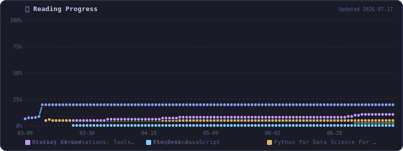

# 👋 Hi, I'm Mian Muhammad

<h3>Let's Connect and have a Chat! 💬</h3>

  
  
  
  

---

<table align="center">
  <tr>
    <td colspan="2">
      <h3 align="left">📚 Reading</h3>
<!-- BOOKS:START -->
<b>0</b> finished &nbsp;·&nbsp; <b>4</b> in progress &nbsp;·&nbsp; <b>6</b> total in library &nbsp;·&nbsp; Last updated: March 26, 2026

<h4>📖 Currently Reading</h4>
<table>
<tr><th></th><th>Book</th><th>Author</th><th>Progress</th></tr>
<tr><td></td><td><b>History of God</b></td><td>Karen Armstrong</td><td><code>██░░░░░░░░</code> 20%</td></tr>
<tr><td></td><td><b>Python for Data Science For Dummies</b></td><td>John Paul Mueller</td><td><code>█░░░░░░░░░</code> 5%</td></tr>
<tr><td></td><td><b>Crucial Conversations: Tools for Talking When Stakes are High, Third Edition, 3rd Edition</b></td><td>Joseph Grenny</td><td><code>░░░░░░░░░░</code> 4%</td></tr>
<tr><td></td><td><b>Eloquent JavaScript</b></td><td>Marijn Haverbeke</td><td><code>░░░░░░░░░░</code> 0%</td></tr>
</table>

<h4>✅ Recently Finished</h4>

<em>No finished books yet.</em>

<!-- BOOKS:END --></td>
  </tr>
  <tr>
    <td colspan="2">
      <h3 align="left">📈 Reading Progress &nbsp;</h3>
</td>
  </tr>
  <tr>
    <td valign="top" width="50%">
      <h3 align="left">📋 Profile Summary</h3>
      
        
      <h3 align="left">📊 GitHub Stats</h3>
      
    </td>
    <td valign="top" width="50%">
      <h3 align="left">🎵 Now Playing</h3>
      
        
      <h3 align="left">📺 Recently Watched</h3>
      
        
      <h3 align="left">📈 Activity Graph</h3>
      
        
      

        
        
        
      

    </td>
  </tr>
</table>

---

### 📌 Previous Account

> **Note:** I lost access to my previous GitHub account. You can find my earlier work here:
> 
> 
